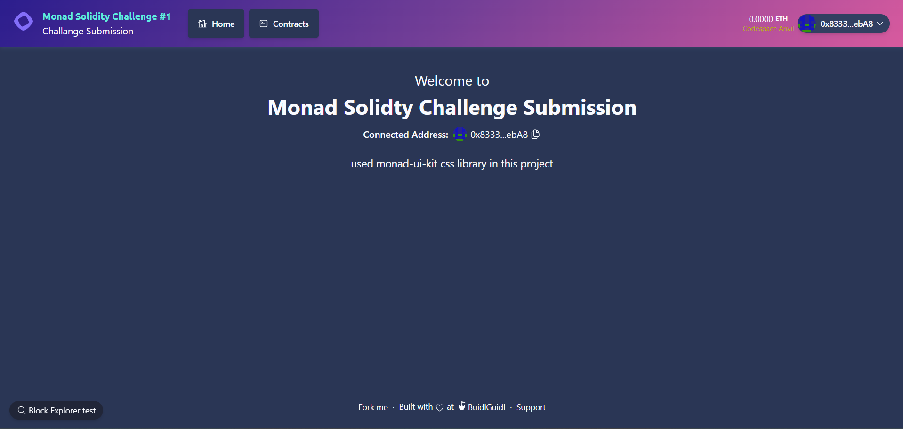

# **Monad Solidity Challenge #1 Submission**
---


## **Overview of the Contracts**

### 1. **YourContract.sol**
- **Purpose**: A simple wallet contract that allows users to deposit, withdraw, and check their ERC20 token balances.
- **Features**:
  - **Deposit**: Users can deposit any ERC20 tokens into the wallet.
  - **Withdraw**: Users can withdraw their tokens if they have sufficient balance.
  - **Balance Check**: Allows users to view their wallet balances for specific tokens.
  - **Owner Management**: The contract includes ownership management functionality.

---

### 2. **MonadToken.sol**
- **Purpose**: A standard ERC20 token contract for the token **"Monad Token"** (symbol: `MON`).
- **Features**:
  - Total supply of `1,000,000 MON` tokens minted to the deployer during deployment.
  - Standard ERC20 functionalities (transfer, approve, etc.).

---

## **Testing the Project**

This project uses **Foundry** for testing. The test suite verifies key functionalities like token deposit, balance checks, and token approval.

### **Test File: YourContract.t.sol**
Located in `test/YourContract.t.sol`.

#### Key Test Case: `testDeposit`
- **Purpose**: Tests the deposit functionality of the `YourContract`.
- **Steps**:
  1. Deploy `YourContract` and a mock ERC20 token (`MockERC20`).
  2. Transfer tokens to a test user (`user1`).
  3. Approve the wallet contract to spend tokens on behalf of the user.
  4. Deposit tokens into the wallet contract.
  5. Verify the user’s token balance in the wallet.

---

## **Setup and Build**

Follow these steps to set up and build the project:

### **1. Clone the Repository**
```bash
git clone <repository-url>
cd simple-token-wallet-challenge
```

### **2. Install Dependencies**
Ensure **Foundry** is installed. If not, install it:

```bash
curl -L https://foundry.paradigm.xyz | bash
foundryup
```

Install libraries such as OpenZeppelin:

```bash
forge install openzeppelin/openzeppelin-contracts
```

### **3. Build the Contracts**
Run the following command to compile the contracts:

```bash
forge build
```

### **4. Run Tests**
Execute the test suite with:

```bash
forge test
```

---

## **Example Output**

When the tests run successfully, you should see output like:

```
Ran 1 test for test/YourContract.t.sol:YourContractTest
[PASS] testDeposit() (gas: 85549)
Logs:
  🔧 Setting up the test environment...
  🚀 Deploying YourContract and MockERC20...
  💸 Transferring 100 MTK to user1...
  ✅ Setup completed.
  🔎 Running testDeposit...
  👤 Starting prank as user1...
  🔐 Approving YourContract to spend 50 MTK...
  💾 Depositing 50 MTK to YourContract...
  📊 Checking balance in YourContract...
  User1's balance in YourContract: 50000000000000000000
  ✅ testDeposit completed successfully.

Suite result: ok. 1 passed; 0 failed; 0 skipped; finished in 856.60µs (281.74µs CPU time)

Ran 1 test suite in 29.78ms (856.60µs CPU time): 1 tests passed, 0 failed, 0 skipped (1 total tests)
```

---

## **Contract Deployment (Optional)**

You can deploy these contracts to a local or live blockchain using Foundry's `forge create` command or tools like Hardhat or Remix.

**Deploy `YourContract`**:
```bash
forge create --rpc-url <rpc-url> --private-key <your-private-key> YourContract
```

**Deploy `MonadToken`**:
```bash
forge create --rpc-url <rpc-url> --private-key <your-private-key> MonadToken
```

---

## **License**

This project is licensed under the [MIT License](https://opensource.org/licenses/MIT).

---

## **Contributors**
- **Çağın Ağırdemir**  
Feel free to fork, contribute, and open pull requests!

---

## **Acknowledgments**
This project was forked and inspired by **ScaffoldETH2** and built using the **Foundry** development environment.

